# Backend 架構圖

以 Mermaid 描述 `backend/` 的功能分解、元件關係、主要流程時序與狀態機，並逐檔標示程式碼狀態。

- 對照：[`DELIVERY.md`](DELIVERY.md)（各批次交付細節）、[`ACCEPTANCE.md`](ACCEPTANCE.md)（驗收狀態）、[`PROGRESS.md`](PROGRESS.md)（進度與待辦）
- 狀態圖例：✅ 源碼完成（已有自動化測試）／🟡 部分完成／⬜ 未實作。源碼完成 ≠ 已部署 ≠ 正式驗收通過。
- 最後更新：2026-10-12（commit `167086a` 之後；含無用程式碼清理）

## 目錄

1. [功能地圖（大功能 → 小功能）](#1-功能地圖大功能--小功能)
2. [執行期部署](#2-執行期部署)
3. [分層與請求路徑](#3-分層與請求路徑)
4. [各大功能：元件與時序](#4-各大功能元件與時序)
5. [狀態機](#5-狀態機)
6. [資料模型](#6-資料模型)
7. [程式碼索引與狀態](#7-程式碼索引與狀態)
8. [未完成項目](#8-未完成項目)
9. [無用程式碼檢查](#9-無用程式碼檢查)

---

## 1. 功能地圖（大功能 → 小功能）

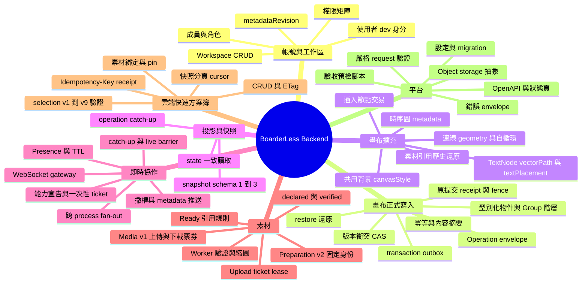
```mermaid
mindmap
  root((BoarderLess Backend))
    帳號與工作區
      使用者 dev 身分
      Workspace CRUD
      成員與角色
      權限矩陣
      metadataRevision
    畫布正式寫入
      Operation envelope
      冪等與內容摘要
      版本衝突 CAS
      型別化物件與 Group 階層
      restore 還原
      原提交 receipt 與 fence
      transaction outbox
    畫布擴充
      共用背景 canvasStyle
      連線 geometry 與自循環
      插入節點交易
      TextNode vectorPath 與 textPlacement
      時序圖 metadata
      素材引用歷史還原
    投影與快照
      state 一致讀取
      snapshot schema 1 到 3
      operation catch-up
    即時協作
      能力宣告與一次性 ticket
      WebSocket gateway
      catch-up 與 live barrier
      跨 process fan-out
      Presence 與 TTL
      撤權與 metadata 推送
    素材
      Media v1 上傳與下載票券
      Worker 驗證與縮圖
      Preparation v2 固定身份
      Upload ticket lease
      declared 與 verified
      Ready 引用規則
    雲端快速方案簿
      CRUD 與 ETag
      Idempotency-Key receipt
      快照分頁 cursor
      selection v1 到 v9 驗證
      素材綁定與 pin
    平台
      設定與 migration
      嚴格 request 驗證
      錯誤 envelope
      OpenAPI 與狀態頁
      Object storage 抽象
      驗收預檢腳本
```

| 大功能 | 小功能 | 狀態 | 主要程式碼 |
| --- | --- | --- | --- |
| 帳號與工作區 | 使用者（dev 身分）、Workspace CRUD、成員 / 角色、權限矩陣、metadataRevision | 🟡 正式認證未做 | `middlewares/auth.ts`、`services/{user,workspace,member,access}.service.ts`、`domain/permissions.ts`、`services/workspace-metadata.ts` |
| 畫布正式寫入 | envelope、冪等（request digest）、CAS、型別化物件、Group 階層、restore、receipt / fence、outbox | ✅ | `services/{operation,receipt}.service.ts`、`services/canvas-mutations.ts`、`domain/{operations,canvas-objects}.ts` |
| 畫布擴充 | canvasStyle、relation geometry / 自循環、插入節點、vectorPath / textPlacement、時序圖、素材引用還原 | ✅（端點改接 ⬜） | `domain/{canvas-style,relation-geometry,vector-path,sequence-diagrams,selection}.ts`、`repositories/provenance.repository.ts` |
| 投影與快照 | state、snapshot（schema 1–3）、catch-up | ✅ | `services/snapshot.service.ts`、`repositories/{canvas,snapshot,operation}.repository.ts` |
| 即時協作 | capabilities / ticket、gateway、barrier、fan-out、Presence、撤權 | ✅（正式認證 ⬜） | `realtime/*`、`services/realtime.service.ts`、`repositories/realtime.repository.ts`、`routes/realtime.routes.ts` |
| 素材 | Media v1、worker、preparation v2、lease、declared / verified、Ready 規則 | ✅ | `services/{asset,asset-preparation}.service.ts`、`jobs/*`、`media/*`、`storage/*` |
| 雲端快速方案簿 | CRUD / ETag、receipt、cursor、selection 驗證、素材綁定 | 🟡 materialization、429 未做 | `services/quick-scheme.service.ts`、`routes/quick-scheme.routes.ts`、`domain/selection.ts`、`utils/strict-json.ts` |
| 平台 | 設定、migration、嚴格驗證、錯誤 envelope、OpenAPI、狀態頁、storage 抽象、預檢腳本 | ✅ | `config/env.ts`、`db/*`、`schemas/validator.ts`、`middlewares/error-handler.ts`、`views/*`、`scripts/acceptance/*` |

---

## 2. 執行期部署

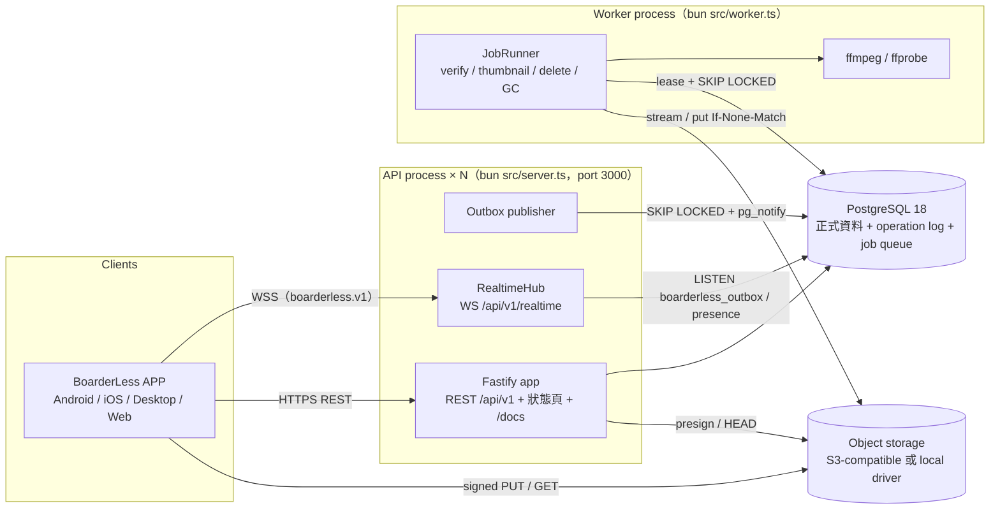
```mermaid
flowchart LR
  subgraph Clients["Clients"]
    APP["BoarderLess APP<br/>Android / iOS / Desktop / Web"]
  end

  subgraph APIProc["API process × N（bun src/server.ts，port 3000）"]
    Fastify["Fastify app<br/>REST /api/v1 + 狀態頁 + /docs"]
    Hub["RealtimeHub<br/>WS /api/v1/realtime"]
    Pub["Outbox publisher"]
  end

  subgraph WorkerProc["Worker process（bun src/worker.ts）"]
    Runner["JobRunner<br/>verify / thumbnail / delete / GC"]
    FF["ffmpeg / ffprobe"]
  end

  PG[("PostgreSQL 18<br/>正式資料 + operation log + job queue")]
  S3[("Object storage<br/>S3-compatible 或 local driver")]

  APP -- "HTTPS REST" --> Fastify
  APP -- "WSS（boarderless.v1）" --> Hub
  APP -- "signed PUT / GET" --> S3
  Fastify --> PG
  Fastify -- "presign / HEAD" --> S3
  Hub -- "LISTEN boarderless_outbox / presence" --> PG
  Pub -- "SKIP LOCKED + pg_notify" --> PG
  Runner -- "lease + SKIP LOCKED" --> PG
  Runner -- "stream / put If-None-Match" --> S3
  Runner --> FF
```

- API 與 worker 分開部署；API 可水平擴充，跨 process 的即時事件只經 PostgreSQL（outbox + LISTEN / NOTIFY），不需要 Redis。
- 每個 API process 需要一條 session-mode PostgreSQL 連線給 LISTEN。
- `STORAGE_DRIVER=local` 時，API 自己提供 `/storage/objects/*` 模擬 presigned URL（只用於開發 / 測試）。

---

## 3. 分層與請求路徑

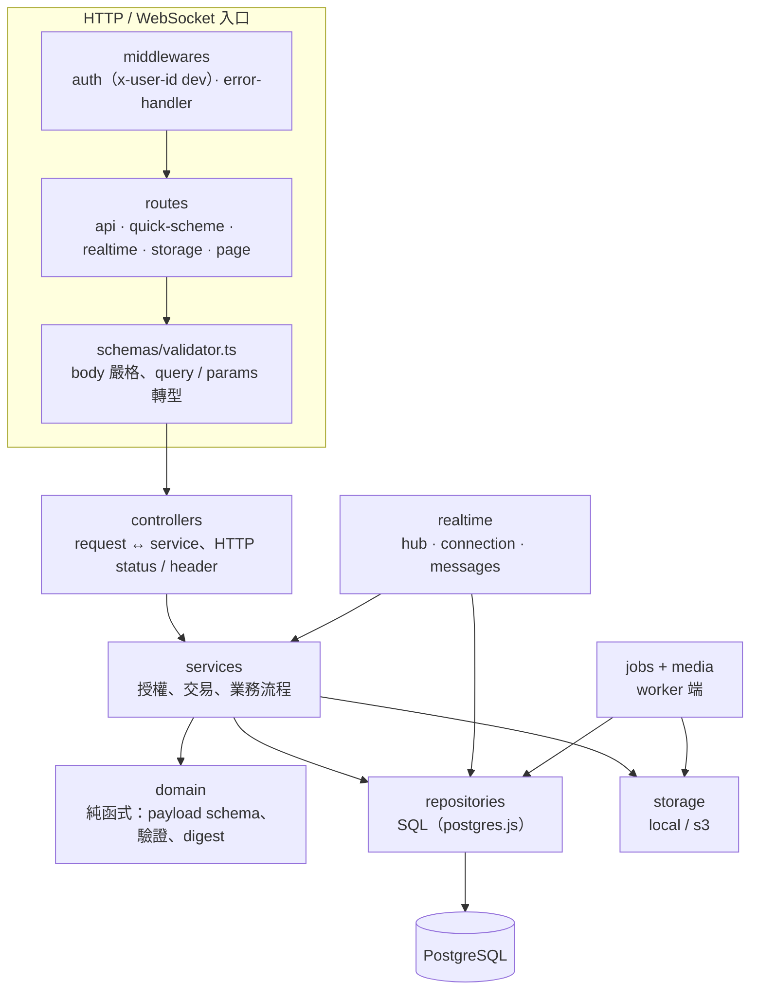
```mermaid
flowchart TB
  subgraph HTTP["HTTP / WebSocket 入口"]
    MW["middlewares<br/>auth（x-user-id dev）· error-handler"]
    VAL["schemas/validator.ts<br/>body 嚴格、query / params 轉型"]
    R["routes<br/>api · quick-scheme · realtime · storage · page"]
  end
  C["controllers<br/>request ↔ service、HTTP status / header"]
  S["services<br/>授權、交易、業務流程"]
  D["domain<br/>純函式：payload schema、驗證、digest"]
  RP["repositories<br/>SQL（postgres.js）"]
  DB[("PostgreSQL")]
  ST["storage<br/>local / s3"]
  RT["realtime<br/>hub · connection · messages"]
  J["jobs + media<br/>worker 端"]

  MW --> R --> VAL --> C --> S
  S --> D
  S --> RP --> DB
  S --> ST
  RT --> S
  RT --> RP
  J --> RP
  J --> ST
```

- `Database.transaction()` 讓 service 在同一個 transaction 內取得綁定該連線的全部 repositories（unit of work）；`readConsistent()` 用於 projection 一致讀取。
- 每個讀寫路徑都在 service 內重新呼叫 `requireWorkspaceAccess`（非成員一律 404、角色不足 403）。

---

## 4. 各大功能：元件與時序

### 4.1 帳號、工作區與權限

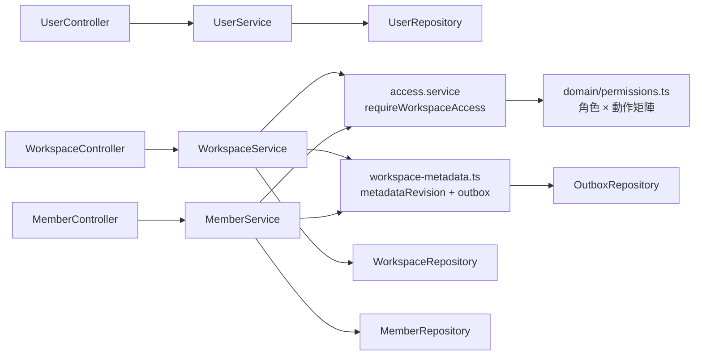
```mermaid
flowchart LR
  UC["UserController"] --> US["UserService"] --> UR["UserRepository"]
  WC["WorkspaceController"] --> WS["WorkspaceService"]
  MC["MemberController"] --> MS["MemberService"]
  WS --> AS["access.service<br/>requireWorkspaceAccess"]
  MS --> AS
  AS --> P["domain/permissions.ts<br/>角色 × 動作矩陣"]
  WS --> WM["workspace-metadata.ts<br/>metadataRevision + outbox"]
  MS --> WM
  WM --> OB["OutboxRepository"]
  WS --> WR["WorkspaceRepository"]
  MS --> MR["MemberRepository"]
```

| 角色 | 讀取 | 寫入畫布 / 素材 | 管理成員 | 刪除 Workspace |
| --- | --- | --- | --- | --- |
| owner | ✅ | ✅ | ✅ | ✅ |
| editor | ✅ | ✅ | ⬜ | ⬜ |
| commenter / viewer | ✅ | ⬜ | ⬜ | ⬜ |

### 4.2 畫布正式寫入（REST 與 WS 共用）

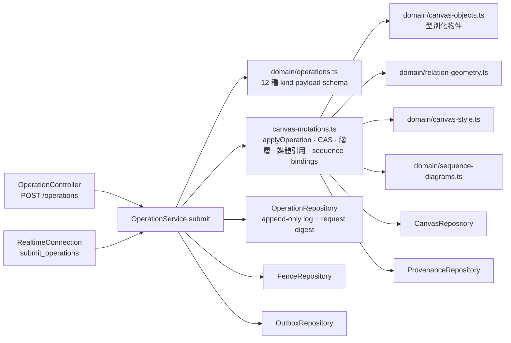
```mermaid
flowchart LR
  OC["OperationController<br/>POST /operations"] --> OS["OperationService.submit"]
  WSConn["RealtimeConnection<br/>submit_operations"] --> OS
  OS --> VP["domain/operations.ts<br/>12 種 kind payload schema"]
  OS --> CM["canvas-mutations.ts<br/>applyOperation · CAS · 階層 · 媒體引用 · sequence bindings"]
  CM --> CO["domain/canvas-objects.ts<br/>型別化物件"]
  CM --> RG["domain/relation-geometry.ts"]
  CM --> CS["domain/canvas-style.ts"]
  CM --> SD["domain/sequence-diagrams.ts"]
  CM --> CR["CanvasRepository"]
  CM --> PR["ProvenanceRepository"]
  OS --> OR["OperationRepository<br/>append-only log + request digest"]
  OS --> FR["FenceRepository"]
  OS --> OB["OutboxRepository"]
```

Operation kinds：`create_object`、`update_object`、`move_objects`、`delete_objects`、`create_relation`、`update_relation`、`delete_relations`、`restore_objects`、`restore_relations`、`update_canvas_style`、`update_sequence_diagrams`、`restore_media_references`。

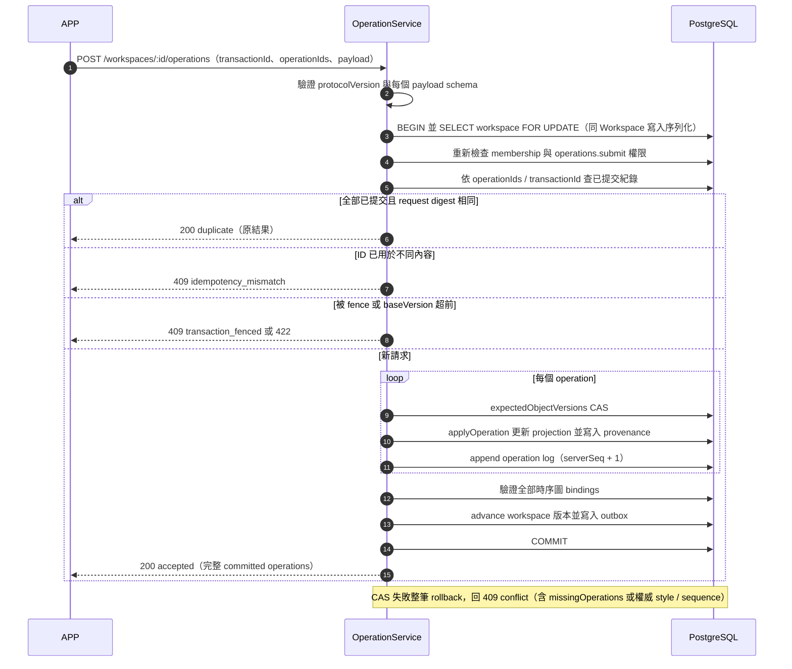
```mermaid
sequenceDiagram
  autonumber
  participant APP
  participant API as OperationService
  participant DB as PostgreSQL
  APP->>API: POST /workspaces/:id/operations（transactionId、operationIds、payload）
  API->>API: 驗證 protocolVersion 與每個 payload schema
  API->>DB: BEGIN 並 SELECT workspace FOR UPDATE（同 Workspace 寫入序列化）
  API->>DB: 重新檢查 membership 與 operations.submit 權限
  API->>DB: 依 operationIds / transactionId 查已提交紀錄
  alt 全部已提交且 request digest 相同
    API-->>APP: 200 duplicate（原結果）
  else ID 已用於不同內容
    API-->>APP: 409 idempotency_mismatch
  else 被 fence 或 baseVersion 超前
    API-->>APP: 409 transaction_fenced 或 422
  else 新請求
    loop 每個 operation
      API->>DB: expectedObjectVersions CAS
      API->>DB: applyOperation 更新 projection 並寫入 provenance
      API->>DB: append operation log（serverSeq + 1）
    end
    API->>DB: 驗證全部時序圖 bindings
    API->>DB: advance workspace 版本並寫入 outbox
    API->>DB: COMMIT
    API-->>APP: 200 accepted（完整 committed operations）
  end
  Note over API,DB: CAS 失敗整筆 rollback，回 409 conflict（含 missingOperations 或權威 style / sequence）
```

### 4.3 原提交 receipt 與 fence

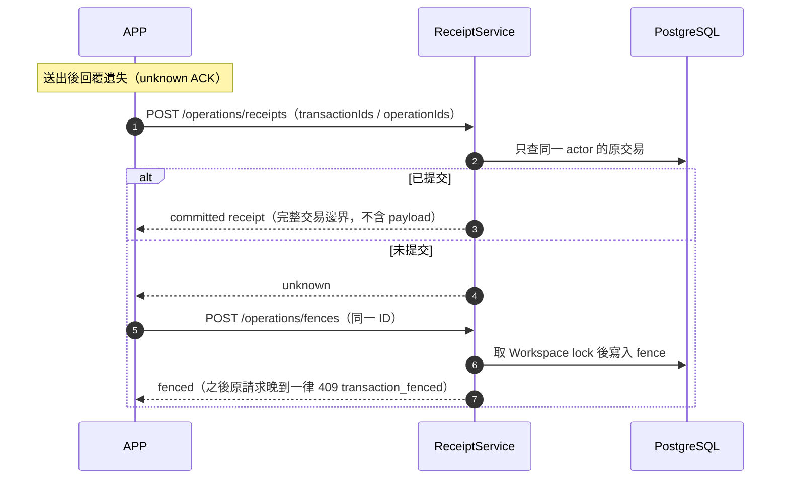
```mermaid
sequenceDiagram
  autonumber
  participant APP
  participant RS as ReceiptService
  participant DB as PostgreSQL
  Note over APP: 送出後回覆遺失（unknown ACK）
  APP->>RS: POST /operations/receipts（transactionIds / operationIds）
  RS->>DB: 只查同一 actor 的原交易
  alt 已提交
    RS-->>APP: committed receipt（完整交易邊界，不含 payload）
  else 未提交
    RS-->>APP: unknown
    APP->>RS: POST /operations/fences（同一 ID）
    RS->>DB: 取 Workspace lock 後寫入 fence
    RS-->>APP: fenced（之後原請求晚到一律 409 transaction_fenced）
  end
```

### 4.4 即時協作

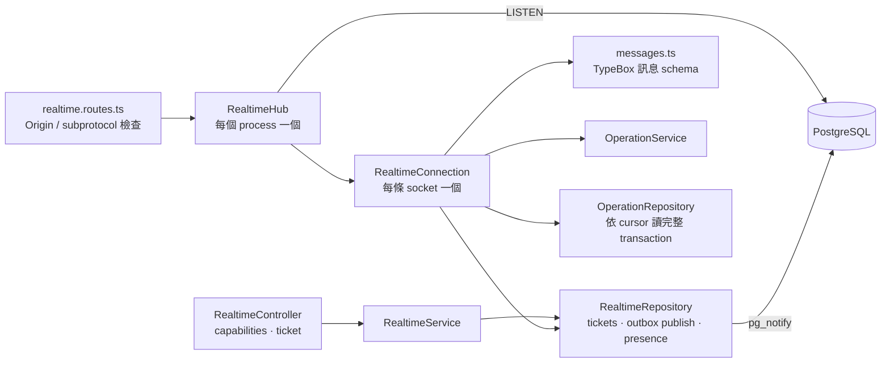
```mermaid
flowchart LR
  RC["RealtimeController<br/>capabilities · ticket"] --> RSv["RealtimeService"]
  RSv --> RR["RealtimeRepository<br/>tickets · outbox publish · presence"]
  Route["realtime.routes.ts<br/>Origin / subprotocol 檢查"] --> Hub["RealtimeHub<br/>每個 process 一個"]
  Hub --> Conn["RealtimeConnection<br/>每條 socket 一個"]
  Conn --> Msg["messages.ts<br/>TypeBox 訊息 schema"]
  Conn --> OS["OperationService"]
  Conn --> RR
  Conn --> OpR["OperationRepository<br/>依 cursor 讀完整 transaction"]
  Hub -- "LISTEN" --> PG[("PostgreSQL")]
  RR -- "pg_notify" --> PG
```

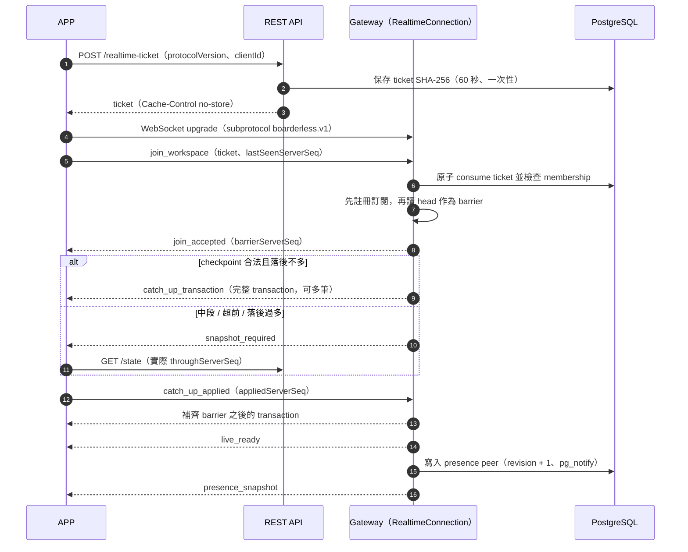
```mermaid
sequenceDiagram
  autonumber
  participant APP
  participant API as REST API
  participant GW as Gateway（RealtimeConnection）
  participant DB as PostgreSQL
  APP->>API: POST /realtime-ticket（protocolVersion、clientId）
  API->>DB: 保存 ticket SHA-256（60 秒、一次性）
  API-->>APP: ticket（Cache-Control no-store）
  APP->>GW: WebSocket upgrade（subprotocol boarderless.v1）
  APP->>GW: join_workspace（ticket、lastSeenServerSeq）
  GW->>DB: 原子 consume ticket 並檢查 membership
  GW->>GW: 先註冊訂閱，再讀 head 作為 barrier
  GW-->>APP: join_accepted（barrierServerSeq）
  alt checkpoint 合法且落後不多
    GW-->>APP: catch_up_transaction（完整 transaction，可多筆）
  else 中段 / 超前 / 落後過多
    GW-->>APP: snapshot_required
    APP->>API: GET /state（實際 throughServerSeq）
  end
  APP->>GW: catch_up_applied（appliedServerSeq）
  GW-->>APP: 補齊 barrier 之後的 transaction
  GW-->>APP: live_ready
  GW->>DB: 寫入 presence peer（revision + 1、pg_notify）
  GW-->>APP: presence_snapshot
```

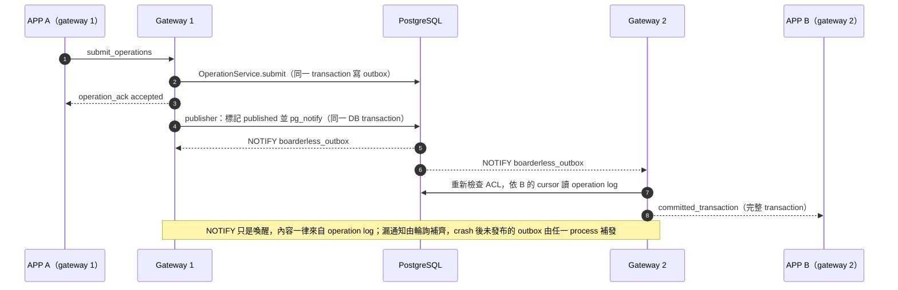
```mermaid
sequenceDiagram
  autonumber
  participant A as APP A（gateway 1）
  participant G1 as Gateway 1
  participant DB as PostgreSQL
  participant G2 as Gateway 2
  participant B as APP B（gateway 2）
  A->>G1: submit_operations
  G1->>DB: OperationService.submit（同一 transaction 寫 outbox）
  G1-->>A: operation_ack accepted
  G1->>DB: publisher：標記 published 並 pg_notify（同一 DB transaction）
  DB-->>G1: NOTIFY boarderless_outbox
  DB-->>G2: NOTIFY boarderless_outbox
  G2->>DB: 重新檢查 ACL，依 B 的 cursor 讀 operation log
  G2-->>B: committed_transaction（完整 transaction）
  Note over G1,G2: NOTIFY 只是喚醒，內容一律來自 operation log；漏通知由輪詢補齊，crash 後未發布的 outbox 由任一 process 補發
```

### 4.5 素材 Media v1 與 worker

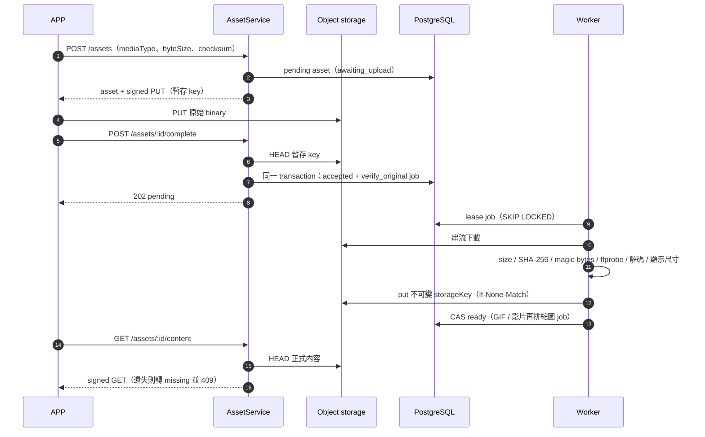
```mermaid
sequenceDiagram
  autonumber
  participant APP
  participant API as AssetService
  participant ST as Object storage
  participant DB as PostgreSQL
  participant W as Worker
  APP->>API: POST /assets（mediaType、byteSize、checksum）
  API->>DB: pending asset（awaiting_upload）
  API-->>APP: asset + signed PUT（暫存 key）
  APP->>ST: PUT 原始 binary
  APP->>API: POST /assets/:id/complete
  API->>ST: HEAD 暫存 key
  API->>DB: 同一 transaction：accepted + verify_original job
  API-->>APP: 202 pending
  W->>DB: lease job（SKIP LOCKED）
  W->>ST: 串流下載
  W->>W: size / SHA-256 / magic bytes / ffprobe / 解碼 / 顯示尺寸
  W->>ST: put 不可變 storageKey（If-None-Match）
  W->>DB: CAS ready（GIF / 影片再排縮圖 job）
  APP->>API: GET /assets/:id/content
  API->>ST: HEAD 正式內容
  API-->>APP: signed GET（遺失則轉 missing 並 409）
```

### 4.6 素材 preparation v2

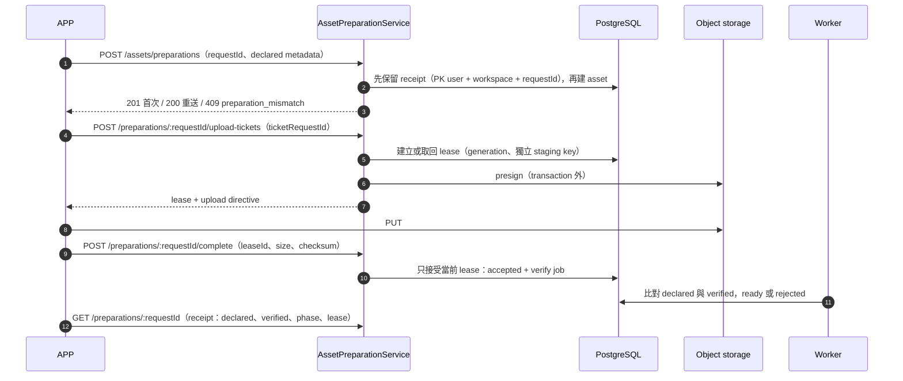
```mermaid
sequenceDiagram
  autonumber
  participant APP
  participant API as AssetPreparationService
  participant DB as PostgreSQL
  participant ST as Object storage
  participant W as Worker
  APP->>API: POST /assets/preparations（requestId、declared metadata）
  API->>DB: 先保留 receipt（PK user + workspace + requestId），再建 asset
  API-->>APP: 201 首次 / 200 重送 / 409 preparation_mismatch
  APP->>API: POST /preparations/:requestId/upload-tickets（ticketRequestId）
  API->>DB: 建立或取回 lease（generation、獨立 staging key）
  API->>ST: presign（transaction 外）
  API-->>APP: lease + upload directive
  APP->>ST: PUT
  APP->>API: POST /preparations/:requestId/complete（leaseId、size、checksum）
  API->>DB: 只接受當前 lease：accepted + verify job
  W->>DB: 比對 declared 與 verified，ready 或 rejected
  APP->>API: GET /preparations/:requestId（receipt：declared、verified、phase、lease）
```

### 4.7 雲端快速方案簿

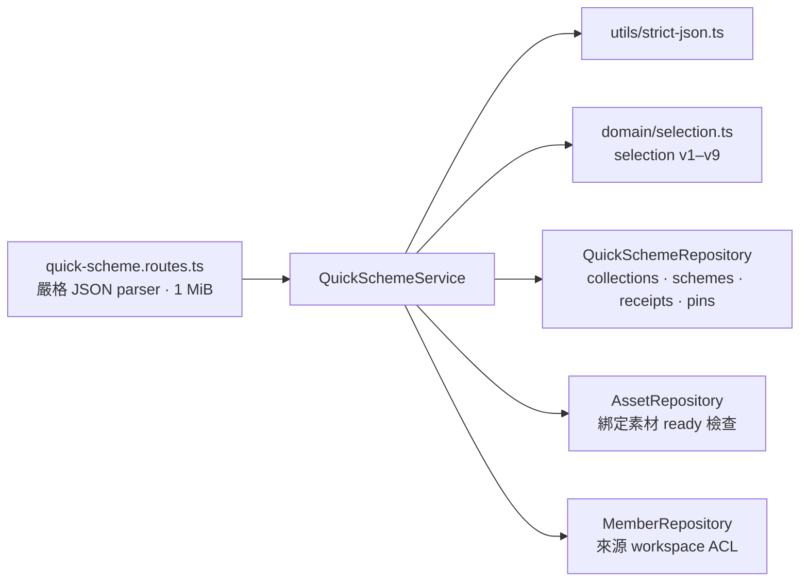
```mermaid
flowchart LR
  QR["quick-scheme.routes.ts<br/>嚴格 JSON parser · 1 MiB"] --> QS["QuickSchemeService"]
  QS --> SJ["utils/strict-json.ts"]
  QS --> SEL["domain/selection.ts<br/>selection v1–v9"]
  QS --> QRep["QuickSchemeRepository<br/>collections · schemes · receipts · pins"]
  QS --> AR["AssetRepository<br/>綁定素材 ready 檢查"]
  QS --> MR["MemberRepository<br/>來源 workspace ACL"]
```

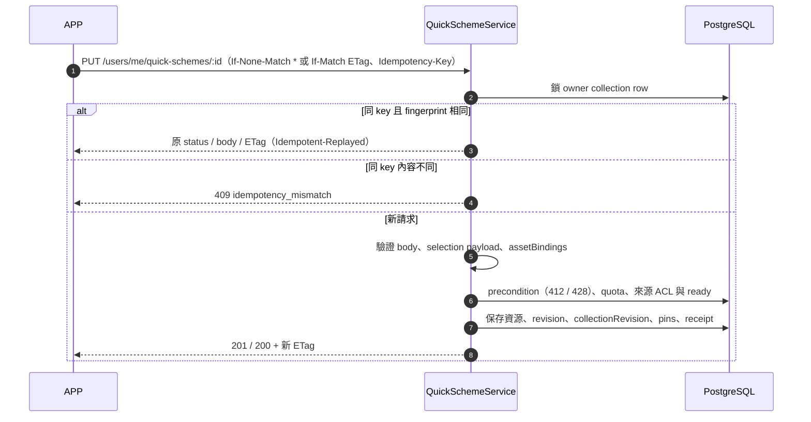
```mermaid
sequenceDiagram
  autonumber
  participant APP
  participant QS as QuickSchemeService
  participant DB as PostgreSQL
  APP->>QS: PUT /users/me/quick-schemes/:id（If-None-Match * 或 If-Match ETag、Idempotency-Key）
  QS->>DB: 鎖 owner collection row
  alt 同 key 且 fingerprint 相同
    QS-->>APP: 原 status / body / ETag（Idempotent-Replayed）
  else 同 key 內容不同
    QS-->>APP: 409 idempotency_mismatch
  else 新請求
    QS->>QS: 驗證 body、selection payload、assetBindings
    QS->>DB: precondition（412 / 428）、quota、來源 ACL 與 ready
    QS->>DB: 保存資源、revision、collectionRevision、pins、receipt
    QS-->>APP: 201 / 200 + 新 ETag
  end
```

### 4.8 畫布擴充：共用背景、時序圖、素材引用還原

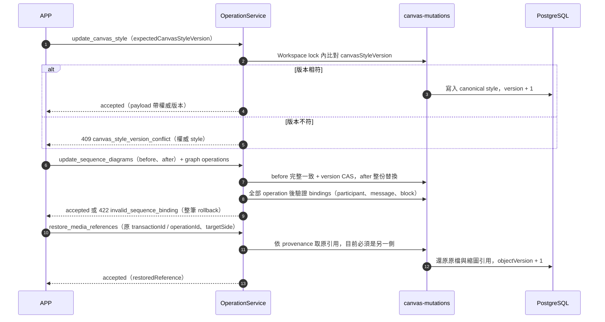
```mermaid
sequenceDiagram
  autonumber
  participant APP
  participant OS as OperationService
  participant CM as canvas-mutations
  participant DB as PostgreSQL
  APP->>OS: update_canvas_style（expectedCanvasStyleVersion）
  OS->>CM: Workspace lock 內比對 canvasStyleVersion
  alt 版本相符
    CM->>DB: 寫入 canonical style，version + 1
    OS-->>APP: accepted（payload 帶權威版本）
  else 版本不符
    OS-->>APP: 409 canvas_style_version_conflict（權威 style）
  end
  APP->>OS: update_sequence_diagrams（before、after）+ graph operations
  OS->>CM: before 完整一致 + version CAS，after 整份替換
  OS->>CM: 全部 operation 後驗證 bindings（participant、message、block）
  OS-->>APP: accepted 或 422 invalid_sequence_binding（整筆 rollback）
  APP->>OS: restore_media_references（原 transactionId / operationId、targetSide）
  OS->>CM: 依 provenance 取原引用，目前必須是另一側
  CM->>DB: 還原原檔與縮圖引用，objectVersion + 1
  OS-->>APP: accepted（restoredReference）
```

---

## 5. 狀態機

### 5.1 素材 phase（Media v1 + preparation v2）

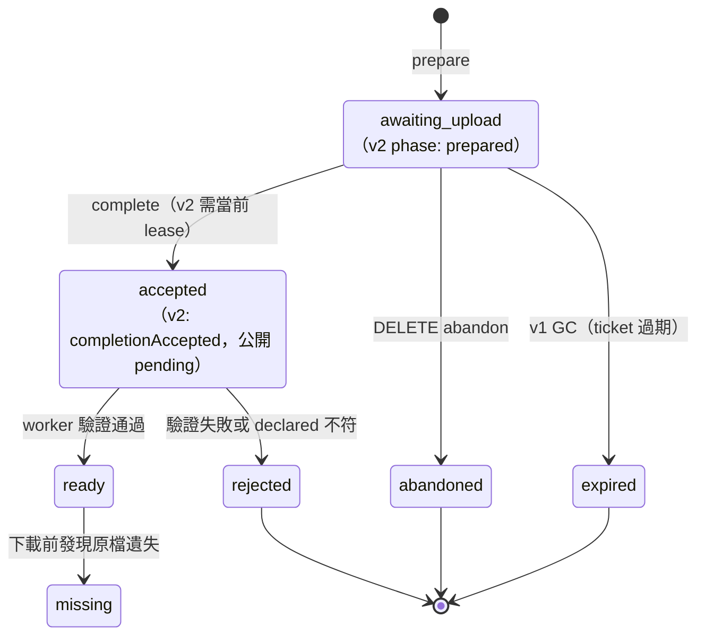
```mermaid
stateDiagram-v2
  state "awaiting_upload<br/>（v2 phase: prepared）" as awaiting
  state "accepted<br/>（v2: completionAccepted，公開 pending）" as accepted
  [*] --> awaiting: prepare
  awaiting --> accepted: complete（v2 需當前 lease）
  awaiting --> abandoned: DELETE abandon
  awaiting --> expired: v1 GC（ticket 過期）
  accepted --> ready: worker 驗證通過
  accepted --> rejected: 驗證失敗或 declared 不符
  ready --> missing: 下載前發現原檔遺失
  abandoned --> [*]
  expired --> [*]
  rejected --> [*]
```

- v2 的 reservation 不會被 v1 GC 過期；只有過期且未被接受的 lease staging object 會被回收。receipt 與 tombstone 永久保留。

### 5.2 背景工作（asset_jobs）

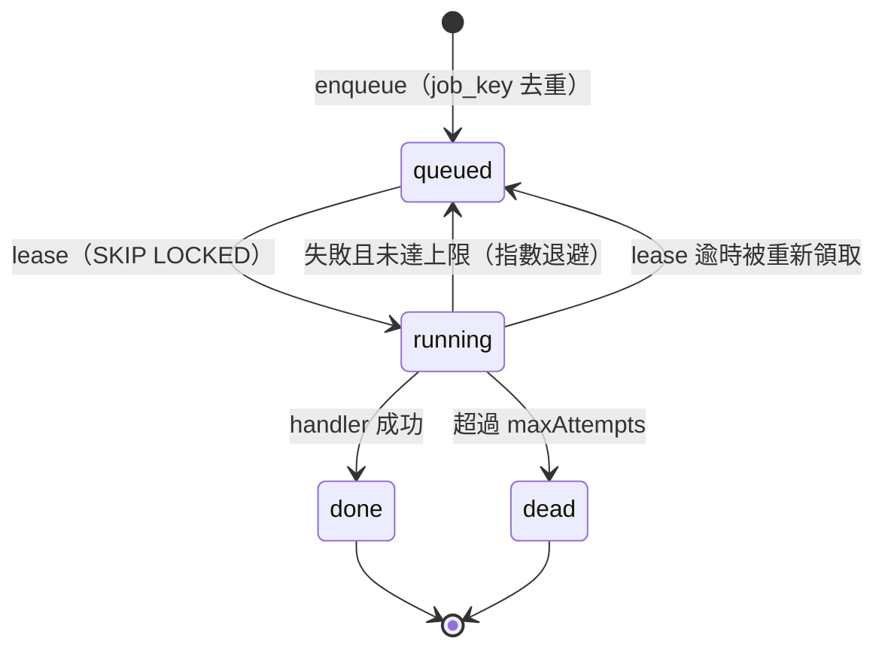
```mermaid
stateDiagram-v2
  [*] --> queued: enqueue（job_key 去重）
  queued --> running: lease（SKIP LOCKED）
  running --> done: handler 成功
  running --> queued: 失敗且未達上限（指數退避）
  running --> queued: lease 逾時被重新領取
  running --> dead: 超過 maxAttempts
  done --> [*]
  dead --> [*]
```

### 5.3 即時協作連線

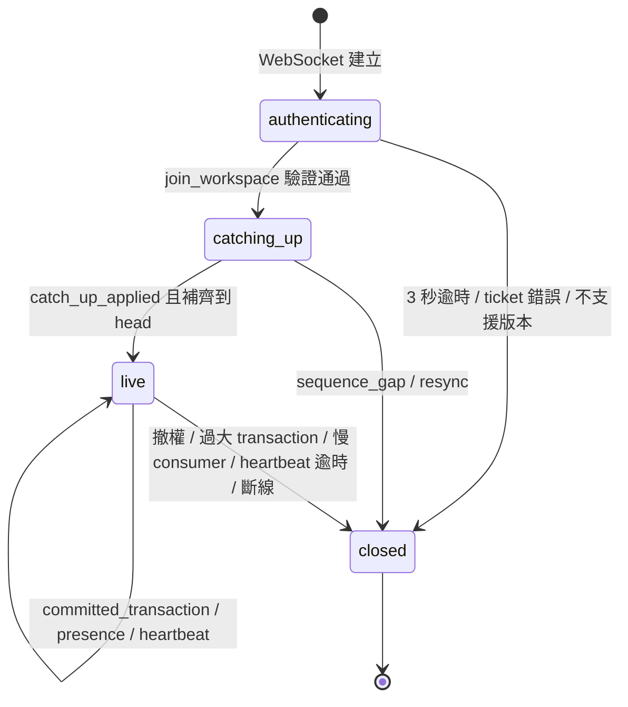
```mermaid
stateDiagram-v2
  [*] --> authenticating: WebSocket 建立
  authenticating --> catching_up: join_workspace 驗證通過
  authenticating --> closed: 3 秒逾時 / ticket 錯誤 / 不支援版本
  catching_up --> live: catch_up_applied 且補齊到 head
  catching_up --> closed: sequence_gap / resync
  live --> live: committed_transaction / presence / heartbeat
  live --> closed: 撤權 / 過大 transaction / 慢 consumer / heartbeat 逾時 / 斷線
  closed --> [*]
```

### 5.4 快速方案資源

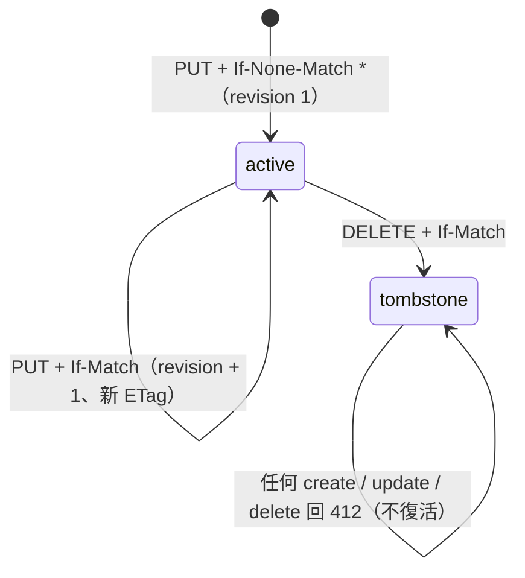
```mermaid
stateDiagram-v2
  [*] --> active: PUT + If-None-Match *（revision 1）
  active --> active: PUT + If-Match（revision + 1、新 ETag）
  active --> tombstone: DELETE + If-Match
  tombstone --> tombstone: 任何 create / update / delete 回 412（不復活）
```

### 5.5 時序圖 / 共用背景版本

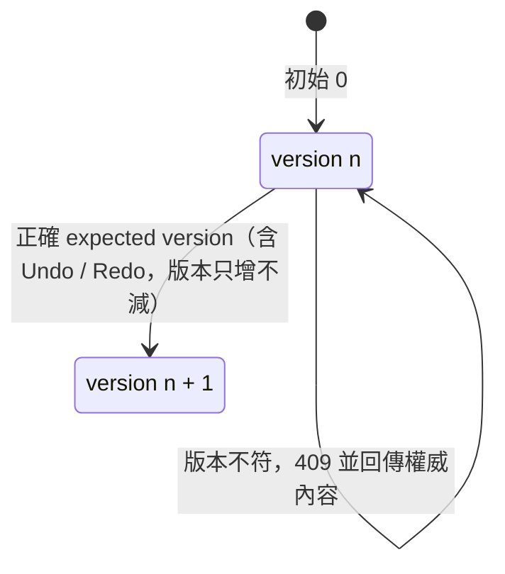
```mermaid
stateDiagram-v2
  state "version n" as vn
  state "version n + 1" as vn1
  [*] --> vn: 初始 0
  vn --> vn1: 正確 expected version（含 Undo / Redo，版本只增不減）
  vn --> vn: 版本不符，409 並回傳權威內容
```

---

## 6. 資料模型

```mermaid
erDiagram
  USERS ||--o{ WORKSPACE_MEMBERS : "加入"
  WORKSPACES ||--o{ WORKSPACE_MEMBERS : "成員"
  WORKSPACES ||--o{ CANVAS_OBJECTS : "物件"
  WORKSPACES ||--o{ RELATIONS : "關聯"
  CANVAS_OBJECTS ||--o{ RELATIONS : "端點"
  CANVAS_OBJECTS ||--o{ CANVAS_OBJECTS : "parent group"
  WORKSPACES ||--o{ WORKSPACE_OPERATIONS : "operation log"
  WORKSPACES ||--o{ WORKSPACE_SNAPSHOTS : "快照"
  WORKSPACES ||--o{ TRANSACTION_OUTBOX : "待發布事件"
  WORKSPACES ||--o{ TRANSACTION_FENCES : "fence"
  WORKSPACES ||--o{ ASSETS : "素材"
  ASSETS ||--o{ ASSET_JOBS : "背景工作"
  ASSETS ||--o| ASSET_PREPARATIONS : "v2 receipt"
  ASSETS ||--o{ ASSET_UPLOAD_LEASES : "upload lease"
  ASSETS ||--o{ ASSETS : "縮圖 / 衍生"
  WORKSPACES ||--o{ REALTIME_TICKETS : "join ticket"
  USERS ||--|| QUICK_SCHEME_COLLECTIONS : "方案簿"
  USERS ||--o{ QUICK_SCHEMES : "方案"
  USERS ||--o{ QUICK_SCHEME_RECEIPTS : "冪等 receipt"
  QUICK_SCHEMES ||--o{ QUICK_SCHEME_ASSET_PINS : "素材保留"
  ASSETS ||--o{ QUICK_SCHEME_ASSET_PINS : "被保留"
  WORKSPACES ||--o{ MEDIA_REFERENCE_PROVENANCE : "引用變更證據"

  WORKSPACES {
    uuid id PK
    bigint current_version
    bigint last_server_seq
    bigint metadata_revision
    jsonb canvas_style
    bigint canvas_style_version
    jsonb sequence_diagrams
    bigint sequence_diagrams_version
  }
  WORKSPACE_OPERATIONS {
    uuid workspace_id PK
    bigint server_seq PK
    uuid operation_id
    uuid transaction_id
    uuid actor_id
    jsonb payload
    text request_digest
  }
  ASSETS {
    uuid id PK
    uuid workspace_id FK
    text status
    text phase
    smallint preparation_version
    uuid upload_lease_id
  }
  QUICK_SCHEMES {
    uuid id PK
    uuid owner_id FK
    bigint revision
    text etag
    jsonb payload
    timestamptz deleted_at
  }
```

- `PRESENCE_ROOMS` / `PRESENCE_PEERS` 是 UNLOGGED 暫態表（DB crash 後清空、以新 roomEpoch 重建），不屬於正式資料，圖中省略。
- Migration：`001` 初始 → `002` 素材生命週期 / job → `003` receipt / fence → `004`–`005` preparation v2 → `006` 即時協作 → `007` 方案簿 → `008` 共用背景 → `009` 時序圖 → `010` 素材引用 provenance → `011` request digest。

---

## 7. 程式碼索引與狀態

### 7.1 入口、設定與平台

| 檔案 | 職責 | 狀態 |
| --- | --- | --- |
| `src/server.ts` | API process 入口（Fastify + RealtimeHub） | ✅ |
| `src/worker.ts` | Worker process 入口（JobRunner） | ✅ |
| `src/app.ts` | 組裝 Fastify：驗證器、錯誤處理、CORS、OpenAPI、路由、即時協作 hook | ✅ |
| `src/config/env.ts` | 環境變數（storage、media、worker、realtime） | ✅ |
| `src/db/client.ts`、`src/db/migrate.ts` | postgres.js 連線（camelCase、BIGINT）、migration runner | ✅ |
| `src/middlewares/auth.ts` | `x-user-id` 開發身分 | 🟡 正式認證未做 |
| `src/middlewares/error-handler.ts` | 統一 error envelope、413 / 503 對應 | ✅ |
| `src/schemas/validator.ts` | body 嚴格驗證、query / params 轉型 | ✅ |
| `src/utils/errors.ts`、`stable-json.ts`、`strict-json.ts` | AppError、穩定序列化、嚴格 JSON parser | ✅ |
| `src/views/*`、`src/routes/page.routes.ts`、`controllers/{page,health}.controller.ts`、`services/status.service.ts` | 服務狀態頁、`/health`、`/health/ready` | ✅ |

### 7.2 領域（純函式）

| 檔案 | 職責 | 狀態 |
| --- | --- | --- |
| `domain/operations.ts` | 12 種 operation payload schema、touched ids | ✅ |
| `domain/canvas-objects.ts`、`node-shapes.ts` | text / group / media 型別化 schema、25 種形狀、vectorPath / textPlacement 規則 | ✅ |
| `domain/permissions.ts` | 角色 × 動作矩陣 | ✅（commenter 細節待定） |
| `domain/canvas-style.ts` | canvasStyle schema 1、default、token 規則 | ✅ |
| `domain/relation-geometry.ts` | geometry 寫入格式與自循環規則 | ✅ |
| `domain/vector-path.ts` | vectorPath / textPlacement 寫入格式 | ✅ |
| `domain/sequence-diagrams.ts` | 時序圖寫入格式、canonical、binding 驗證 | ✅ |
| `domain/selection.ts` | selection v1–v9 結構與語意驗證（APP validator 移植；D / E 共用片段） | ✅ |
| `domain/asset-preparation.ts` | declared canonical、requestDigest、duration 容差 | ✅ |

### 7.3 服務

| 檔案 | 職責 | 狀態 |
| --- | --- | --- |
| `services/access.service.ts` | membership / 角色檢查（非成員 404） | ✅ |
| `services/user.service.ts`、`workspace.service.ts`、`member.service.ts`、`workspace-metadata.ts` | 使用者、Workspace、成員、metadataRevision | ✅ |
| `services/operation.service.ts` | submit 交易、冪等 digest、衝突、catch-up | ✅ |
| `services/canvas-mutations.ts` | applyOperation、CAS、階層、媒體引用、sequence bindings、provenance | ✅ |
| `services/receipt.service.ts` | 原提交 receipt 與 fence | ✅ |
| `services/snapshot.service.ts` | state 與 snapshot（schema 3） | ✅ |
| `services/asset.service.ts` | Media v1 prepare / complete / content / abandon | ✅ |
| `services/asset-preparation.service.ts` | preparation v2 receipt / lease / complete | ✅ |
| `services/quick-scheme.service.ts` | 方案簿 CRUD、receipt、cursor、素材綁定 | 🟡 materialization、429 未做 |
| `services/realtime.service.ts` | realtime capabilities、ticket | ✅ |

### 7.4 即時協作

| 檔案 | 職責 | 狀態 |
| --- | --- | --- |
| `realtime/messages.ts` | client / server 訊息 TypeBox schema、錯誤碼、close codes | ✅ |
| `realtime/hub.ts` | 每 process 的 gateway：LISTEN、outbox publisher、輪詢、presence TTL sweep | ✅ |
| `realtime/connection.ts` | 單一連線狀態機：join、barrier、pump、submit、presence、撤權 | ✅ |
| `routes/realtime.routes.ts`、`controllers/realtime.controller.ts`、`schemas/realtime.schema.ts` | WS route、REST capabilities / ticket | ✅ |

### 7.5 Repositories（SQL）

| 檔案 | 資料表 | 狀態 |
| --- | --- | --- |
| `repositories/index.ts` | `Database`（unit of work、一致讀取） | ✅ |
| `user` / `workspace` / `member` | users、workspaces、workspace_members | ✅ |
| `canvas` | canvas_objects、relations | ✅ |
| `operation` / `outbox` / `fence` / `snapshot` | workspace_operations、transaction_outbox、transaction_fences、workspace_snapshots | ✅ |
| `asset` / `job` / `preparation` / `provenance` | assets、asset_jobs、asset_preparations、asset_upload_leases、media_reference_provenance | ✅ |
| `realtime` | realtime_tickets、presence_rooms、presence_peers、outbox publish | ✅ |
| `quick-scheme` | quick_scheme_collections、quick_schemes、quick_scheme_receipts、quick_scheme_asset_pins | ✅ |

### 7.6 素材處理與 storage

| 檔案 | 職責 | 狀態 |
| --- | --- | --- |
| `jobs/runner.ts`、`context.ts` | durable job 執行（lease、heartbeat、重試、dead-letter）、定期 GC | ✅ |
| `jobs/verify-original.job.ts` | 原檔驗證、declared 比對、不可變 promote、ready / rejected | ✅ |
| `jobs/generate-thumbnail.job.ts`、`delete-object.job.ts`、`upload-gc.ts` | 縮圖、刪除物件、過期上傳與 lease 回收 | ✅ |
| `media/ffmpeg.ts`、`inspect.ts`、`sniff.ts`、`files.ts`、`orientation.ts` | ffprobe / ffmpeg、格式檢查、magic bytes、串流雜湊、EXIF orientation | ✅ |
| `storage/index.ts`、`types.ts`、`local.storage.ts`、`s3.storage.ts`、`routes/storage.routes.ts` | storage 抽象、本機簽名 URL、S3（aws4fetch） | ✅ |

### 7.7 路由、controller 與 schema

| 檔案 | 路由 | 狀態 |
| --- | --- | --- |
| `routes/api.routes.ts` + `controllers/{user,workspace,member,operation,snapshot,asset,asset-preparation,capabilities}.controller.ts` | `/api/v1` 下的 users、workspaces、members、operations（含 receipts / fences）、state / snapshots、assets、assets/preparations、capabilities | ✅ |
| `routes/quick-scheme.routes.ts` | `/api/v1/users/me/quick-scheme(s)…` | ✅ |
| `schemas/*.schema.ts` | request / response JSON Schema（OpenAPI 與 fixtures 契約測試共用） | ✅ |

### 7.8 測試、fixtures 與腳本

| 路徑 | 內容 | 狀態 |
| --- | --- | --- |
| `tests/unit/*` | 純函式、fixtures 契約（每個 fixture 依 schema 驗證） | ✅ |
| `tests/integration/*` | 真 PostgreSQL（+ ffmpeg / 真 WebSocket）整合測試；464 個測試 | ✅ |
| `tests/fixtures/contract/*` | media-v1、canvas-v1、asset-preparation-v2、realtime-v1、quick-scheme-v2、canvas-style-v1、graph-v2、sequence-v1、media-restore-v1 | ✅ |
| `scripts/generate-*-fixtures.ts`、`fixture-recorder.ts` | 錄製 fixtures（`bun run fixtures:all`） | ✅ |
| `scripts/acceptance/db-restart.ts`、`multi-process.ts` | 真 DB 重啟、真多 process 預檢 | ✅（預檢，非正式驗收） |

---

## 8. 未完成項目

| 項目 | 影響範圍 | 目前狀態 |
| --- | --- | --- |
| 正式認證 | 所有 API、realtime ticket、方案簿 | 只有 `x-user-id` 開發替身 |
| 429 限流 | 方案簿與 REST 寫入 | 未實作 |
| 跨 workspace 素材搬移 | 方案簿引用其他 workspace 素材的插入 | 未實作（capability false） |
| relation 端點改接 | update_relation 改端點 | 未實作（`unsupported_change`） |
| 部署與正式驗收 | 全部 | 未執行（見 ACCEPTANCE.md） |

---

## 9. 無用程式碼檢查

```bash
bun run deadcode
```

- `tsc --noUnusedLocals --noUnusedParameters`：沒有未使用的區域變數、import 或參數。
- knip（設定見 [`knip.json`](knip.json)）：檢查未使用檔案、依賴、未列依賴、未解析 import、未使用 class / enum 成員與重複匯出，目前**沒有任何項目**。
- 2026-10-12 清理時移除：未被引用的 `src/models/index.ts`、`ClientMessage`、`CHECKSUM_PATTERN`、`serviceUnavailable`、`OutboxEvent`、`OutboxRepository.listUnpublished`（已由即時協作的 outbox publisher 取代）、`UserService.get`、`RealtimeHub.connectionCount`、`storage/index.ts` 的再匯出。
- knip 另外列出約 140 個「有 export 但只在同檔案內使用」的符號（schema 片段、型別、常數）。它們都有被使用、不是無用程式碼，保留 export 方便測試與文件引用，因此不列入 `deadcode` 的檢查範圍。
